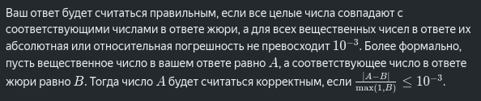
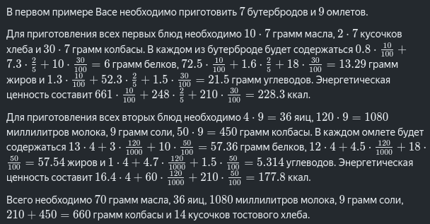
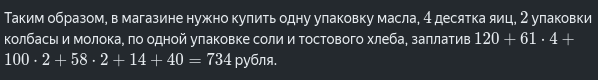

# 176. День рождения Васи

## Бэкэнд. Сложная

Вася и его друзья очень любят вкусно поесть. На свой день рождения каждый обязан удивить других, приготовив новые вкусные и полезные блюда.

Сегодня у Васи день рождения и он позвал своих друзей отведать <i>n</i> своих самых лучших блюд. Название каждого из них состоит из строчных букв английского алфавита, цифр и знака подчёркивания.

Для приготовления блюда с номером <i>i</i> требуется <i>zi</i> ингредиентов. Для каждого ингридиента известно его название, требуемое количество для одной порции блюда, а также единица измерения, в которой это количество задано. Помимо этого, Васе известно, что <i>i</i>-й кулинарный шедевр захотят попробовать <i>ci</i> друзей.

Используются следующие единицы измерения:

-<i>g</i>, <i>kg</i> — граммы и килограммы, соответственно;

- <i>l</i>, <i>ml</i> — литры и миллилитры, соответственно;
- <i>cnt</i>, <i><i>tens</i></i> — одна штука и десять штук, соответственно.

В одном килограмме 1000 грамм и в одном литре 1000 миллилитров. Делать перевод из одной единицы измерения в другую можно тогда и только тогда, когда они одновременно обозначают или массу, или объём, или количество.

У Васи есть два справочника ингредиентов. В первом для каждого ингредиента указано его количество в упаковке и цена за упаковку. Во втором справочнике для каждого ингредиента указано содержание белков, жиров, углеводов и энергетическая ценность некоторого количества данного ингредиента.

Васе нужно приготовить все блюда, при этом не купить ничего лишнего. Для этого ему нужно определить, какие ингредиенты и в каком количестве необходимо приобрести в магазине.

Так как друзья именинника очень следят за тем, что едят, то они, перед тем как попробовать Васины блюда, захотят узнать всё про них: как Вася готовил блюда, нет ли в продуктах ГМО, энергетическую ценность каждого блюда и содержание белков, жиров и углеводов в нём. Васе нужно также предоставить эту информацию.

Необходимо помочь имениннику подсчитать, сколько требуется потратить денег на покупку продуктов в магазине, какие ингредиенты и в каком количестве нужно купить, а также для каждого блюда подсчитать содержание белков, жиров, углеводов и энергетическую ценность, если его съесть полностью.

## Формат ввода

Первая строка содержит целое число <i>n</i> (1⩽n⩽1000) — количество блюд, которое решил приготовить Вася.

Затем следует описание <i>n</i> блюд. В первой строке содержатся строка <i>di</i> и целые числа <i>ci</i>, <i>zi</i> (1⩽<i>ci,zi</i>⩽100) — название блюда, количество друзей, желающих отведать данное блюдо, и количество ингредиентов необходимых для приготовления. Название блюда состоит из строчных букв английского алфавита, цифр и знака подчёркивания. Его длина не превосходит 20 символов.

В следующих <i>zi</i> строках содержатся описания ингредиентов. В строке с номером <i>j</i> содержатся строка <i>si,j</i> — название ингредиента, целое число <i>ai,j</i> (1⩽<i>ai,j</i>⩽1000) — требуемое количество ингредиента и строка <i>ui</i>,j — название единицы измерения количества. Название ингредиента состоит из строчных букв английского алфавита, цифр и знака подчёркивания. Длина строки не превосходит 20 символов.

Следующая строка содержит целое число <i>k</i> (1⩽<i>k</i>⩽1000) — количество ингредиентов в каталоге цен.

В каждой из следующих <i>k</i> строк, содержатся четыре значения <i>ti</i> <i>pi</i> <i>ai</i> <i>ui</i>, описывающих ингредиент.

- <i>ti</i>​ — название ингредиента, состоящее из строчных букв английского алфавита, цифр и знака подчёркивания. Длина строки не превосходит 20 символов;
- <i>pi</i>​ — стоимость ингредиента, заданная целым числом (1⩽<i>pi</i>⩽1000);
- <i>ai</i>​ — количество ингредиента в упаковке в единицах, заданное целым числом (1⩽<i>ai</i>⩽1000);
- <i>ui</i>​ — единица измерения количества (<i>l</i>, </i>ml</i>,<i>g</i>, <i>kg</i>, <i>cnt</i> или <i>tens</i>).

Следующая строка содержит число <i>m</i> (1⩽<i>m</i>⩽1000) — количество ингредиентов в каталоге еды.

Далее расположены <i>m</i> строк, в каждой из которой содержится семь значений <i>ti</i> <i>ai</i> <i>ui</i> <i>pri</i> <i>fi</i> <i>chi</i> <i>fvi</i>, описывающих ингредиент.

- <i>ti</i>​ — название ингредиента, состоящее из строчных букв английского алфавита, цифр и знака подчёркивания. Длина строки не превосходит 20 символов;
- <i>ai</i>​ — количество ингредиента, для которого указаны характеристики ингредиента, заданное целым числом (1⩽<i>ai</i>⩽1000);
- <i>ui</i>​ — единица измерения (<i>l</i>, m<i>l</i>,<i>g</i>, <i>kg</i>, <i>cnt</i> или <i>tens</i>);
- <i>pri</i>​, <i>fi</i>​, <i>chi</i><i>chi</i>​, <i>fvi</i>​ — содержание белков, жиров, углеводов и энергетическая ценность ингредиента, соответственно, заданные вещественными числами с не более чем шестью знаками после запятой (0⩽<i>pri</i>,<i>fi</i>,<i>chi</i>⩽1000,0⩽<i>fvi</i>⩽10000).

Гарантируется, что:

- в каталогах перечислены все ингредиенты, необходимые для приготовления блюд;
- не существует двух блюд с одинаковым названием;
- не существует двух ингредиентов в одном каталоге с одинаковым названием;
- не существует двух ингредиентов в одном блюде с одинаковым названием;
- для любых двух упоминаний ингридиента единицы измерения, в которых заданы его количества, можно перевести друг в друга.

## Формат вывода

Первая строка должна содержать одно целое число: количество денег, которое нужно потратить Васе на подготовку к празднику.

Далее должны следовать <i>k</i> строк, в каждой из которых через пробел указано название ингредиента и целое число — количество упаковок, которое необходимо купить. Ингредиенты, выведенные в этих <i>k</i> строках должны соответствовать ингредиентам, описанным в первом справочнике.

В следующих <i>n</i> строках через пробел должны быть указаны название блюда и его характеристики, описанные четырьмя вещественными числами: белки, жиры, углеводы и энергетическая ценность.

Ингредиенты и блюда разрешается выводить в любом порядке.

## Примечание

### Пример 1

| Ввод                                 | Вывод                              |
| :----------------------------------- | :--------------------------------- |
| 2                                    | 734                                |
| sandwich 7 3                         | egg 4                              |
| butter 10 g                          | milk 2                             |
| toasted_bread 2 cnt                  | sausage 2                          |
| sausage 30 g                         | butter 1                           |
| omelet 9 4                           | cream 0                            |
| egg 4 cnt                            | salt 1                             |
| milk 120 ml                          | toasted_bread 1                    |
| salt 1 g                             | sandwich 6.00 13.29 21.50 228.3    |
| sausage 50 g                         | omelet 57.360 57.540 5.314 177.800 |
| 7                                    |                                    |
| egg 61 1 tens                        |                                    |
| milk 58 1 l                          |                                    |
| sausage 100 480 g                    |                                    |
| butter 120 180 g                     |                                    |
| cream 100 350 g                      |                                    |
| salt 14 1000 g                       |                                    |
| toasted_bread 40 20 cnt              |                                    |
| 8                                    |                                    |
| egg 1 cnt 13 12 1 16.4               |                                    |
| milk 1 l 3 4.5 4.7 60                |                                    |
| chocolate 90 g 6.8 36.3 47.1 546     |                                    |
| salt 1 kg 0 0 0 0                    |                                    |
| strawberry 100 g 0.4 0.1 7 35        |                                    |
| sausage 100 g 10 18 1.5 210          |                                    |
| toasted_bread 5 cnt 7.3 1.6 52.3 248 |                                    |
| butter 100 g 0.8 72.5 1.3 661        |                                    |
